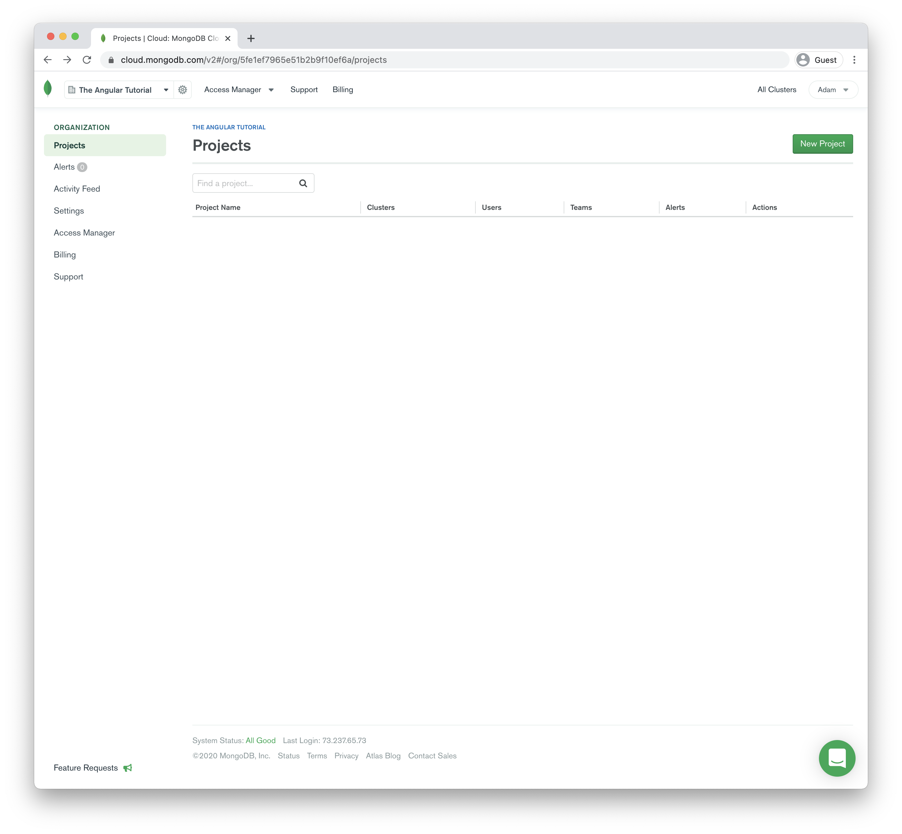
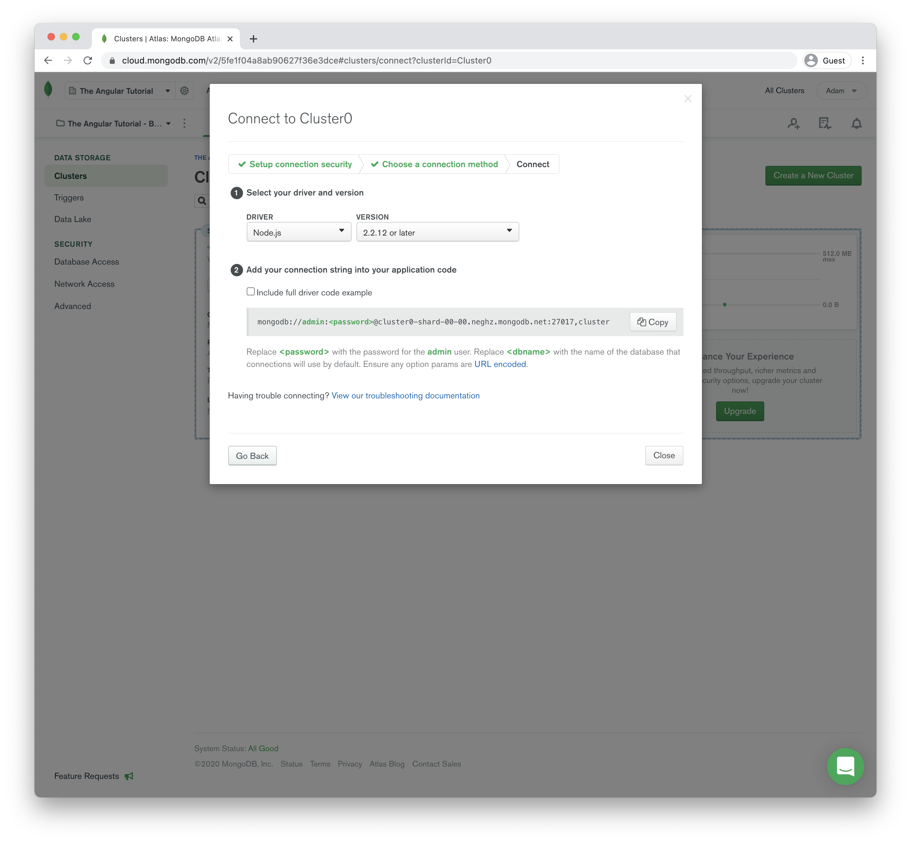

## MongoDB Atlas setup (from Chapter 23)

Up until now, we've been using MongoDB on our local machine as our database. When our applications are deployed and running on Heroku, we'll need a new database in the "cloud" for our API to work with. To do this, we'll be using [MongoDB Atlas](https://www.mongodb.com/cloud/atlas)[^atlas].

*Note: Occasionally services such as MongoDB Atlas will update their registration flows which will affect the steps outlined here. If so, you can find the most up-to-date steps on GitHub in the ["updated-account-registration-flows"](https://github.com/theangulartutorial/lets-get-lunch-code-ng9/tree/master/updated-account-registration-flows)[^updated_account_registration_flows] directory of the source code for this book*

First, you'll need to create an account [here](https://www.mongodb.com/download-center)[^atlas_signup].

Once you've created an account, you should be redirected to a setup page for creating a new Organization. Click "Create an Organization".

Provide a name for your organization and click "Next".

On the next page, click "Create Organization".

Next, you'll need to create a project. Click "Create Project".

Add a name for your project and click "Next".

On the next page, click "Create Project".

On the next page, you'll be prompted to create a database cluseter for this project. Click "Build a Cluster".

On the next page, choose the free option on the right for Shared Clusters by clicking the "Create a Cluster" button.

In the “Cloud Provider & Region” section, select AWS and choose one of the regions near you or leave everything set to their defaults as I have. Then click "Create Cluster".

This process should take anywhere between 7 to 10 minutes. Once it’s done you should see a dashboard like the one below.

Click “Connect” under your cluster name and a setup wizard should open. First, we’ll need to update the whitelist so our database can receive requests from Heroku. Click "Add a Different IP Address".

Add an IP address of 0.0.0.0/0 with an optional description next to it. Then click “Add IP Address”.

Now you’ll need to create an admin user for this database to connect to it from the API. Add your username and password and be sure to remember the creden­tials because you’ll need them in our next steps. Then click “Create Database User”.

Once this user has been created click “Connect” under your Cluster name which should redirect you to this screen in the setup wizard. Click the middle option, “Connect your application”.

Next you’ll need to update the driver version of Node.js to “2.2.12 or later”. This will more than likely not be the default option and it’s very important it’s set to this or your API won’t be able to connect to your database. With that option selected, you should see the “Connection String Only” section update with your connection string.

We’ll use this connection string when we deploy the API to Heroku so keep this information handy since we’ll need it later in the chapter.